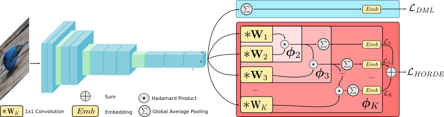

# ICCV 2019 - High-Order Regularizer for Deep Embeddings (HORDE)

This is the code repository for our ICCV 2019 paper [Metric Learning
with HORDE: High-Order Regularizer for Deep Embedding](https://arxiv.org/pdf/1908.02735.pdf).




## Requirements
- Python version 3.5 and higher
- Python packages from "requirements.txt"
- One of the used datasets ([CUB](http://www.vision.caltech.edu/visipedia/CUB-200-2011.html), [CARS](https://ai.stanford.edu/~jkrause/cars/car_dataset.html), [Stanford Online Products](http://cvgl.stanford.edu/projects/lifted_struct/) or [In-Shop Clothes Retrieval](http://mmlab.ie.cuhk.edu.hk/projects/DeepFashion/InShopRetrieval.html))

## Prepare the data and the pretrained models
The datasets should simply be extracted and put in some folder.
You need to adapt the "config.ini" file according to your installation
(dataset locations, temporary path, etc).

You also need one of the pre-trained backbones:
- [GoogleNet](https://drive.google.com/file/d/1e_QwAgaLeQl7Dv_Pm0okKVdpBlYj0Wpz/view?usp=sharing)
- [BN-Inception](https://drive.google.com/file/d/1eqId67njyNaTe3G2mqjb2fWtGE_5XotY/view?usp=sharing)

These files must be placed in the data folder.

You can adjust the training parameters from [config.json](config.json) (epoch, steps per epoch, image size, learning rate, etc).

## Installation
```
pip install -r requirements.txt
```

## Usage
Before running the default script, you must adjust [config.ini](config.ini) according to your installation and [config.json](config.json) files for training parameters.
With default parameters in [config.json](config.json), the default script should give results around 60.0% Recall@1 on the Cub-200-2011 dataset:
```
sh run_cub.sh
```

To train a specific configuration, see the parameter help:
```
python3 train.py --help
```

## Contact
For any questions, please feel free to reach 
```
pierre.jacob@ensea.fr
```

## Compatibility support
As of now (September, 6th, 2019), the code supports 1.9.0 version Tensorflow for GPU usage and **has not been tested with recent ones**. For CPU usage, it still works with recent Tensorflow versions (tested with 1.14.0).

## Citation

If you use this method or this code in your research, please cite as:

Pierre Jacob, David Picard, Aymeric Histace, Edouard Klein. Metric Learning With HORDE: High-Order Regularizer for Deep Embeddings. In The IEEE International Conference on Computer Vision (ICCV), October 2019. 
```
@InProceedings{JACOB_2019_ICCV,
  title={Metric Learning With HORDE: High-Order Regularizer for Deep Embeddings},
  author={Jacob, Pierre and Picard, David and Histace, Aymeric and Klein, Edouard},
  booktitle = {The IEEE International Conference on Computer Vision (ICCV)},
  month = {Oct},
  year = {2019}
}
```


## License
MIT License

Copyright (c) 2019 Pierre Jacob

Permission is hereby granted, free of charge, to any person obtaining a copy
of this software and associated documentation files (the "Software"), to deal
in the Software without restriction, including without limitation the rights
to use, copy, modify, merge, publish, distribute, sublicense, and/or sell
copies of the Software, and to permit persons to whom the Software is
furnished to do so, subject to the following conditions:

The above copyright notice and this permission notice shall be included in all
copies or substantial portions of the Software.

THE SOFTWARE IS PROVIDED "AS IS", WITHOUT WARRANTY OF ANY KIND, EXPRESS OR
IMPLIED, INCLUDING BUT NOT LIMITED TO THE WARRANTIES OF MERCHANTABILITY,
FITNESS FOR A PARTICULAR PURPOSE AND NONINFRINGEMENT. IN NO EVENT SHALL THE
AUTHORS OR COPYRIGHT HOLDERS BE LIABLE FOR ANY CLAIM, DAMAGES OR OTHER
LIABILITY, WHETHER IN AN ACTION OF CONTRACT, TORT OR OTHERWISE, ARISING FROM,
OUT OF OR IN CONNECTION WITH THE SOFTWARE OR THE USE OR OTHER DEALINGS IN THE
SOFTWARE.
